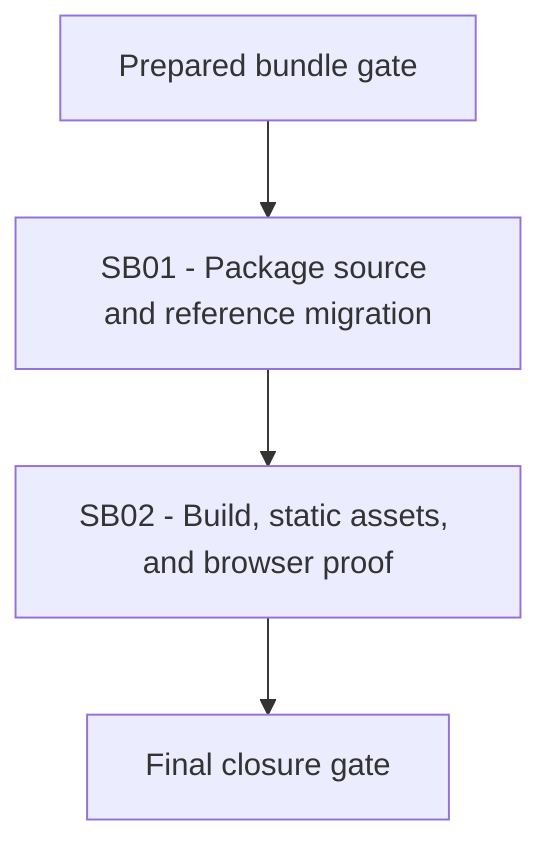

# Phase Plan

## Phase Sequence

1. Prepare and validate this bundle.
2. Execute SB01 package source and reference migration.
3. Execute SB02 build, static asset, and browser proof.
4. Run final closure audit and validators.

## Subbundle Dependency Map

## Critical Subbundles

- SB01 is a critical foundation because every build, test, and UI proof depends on resolving the split component packages from the intended local feed instead of the old source project.
- SB02 is a critical UI closure subbundle because it proves the package static web assets and visual equivalence requested by the user.

## Phase Gates

- Gate G0: Prepared-stage validator passes, or any validator gap is repaired before implementation starts.
- Gate G1: SB01 may close only after source assertions show IPFS has no old external component project reference and package restore/build can resolve BaseLib/CanvasLib from the local package flow.
- Gate G2: SB02 may start only after G1 passes.
- Gate G3: Final closure may pass only after tests/builds, output.css HTTP/browser proof, before/after Playwright screenshots, and screenshot-review analytics are recorded in `reviews/01-execution-report.md`.
