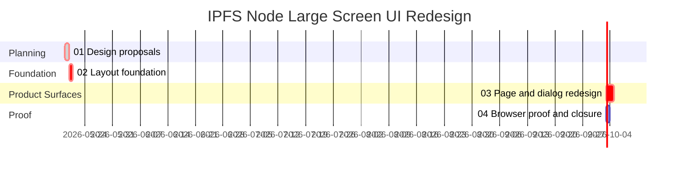

# Phase Plan

## Phase Sequence

1. Prepare design proposal coverage with imagegen summaries, current-state findings, and explicit comparison criteria.
2. Implement the layout foundation: large-screen shell width, compact route stat pattern, and shared-component density rules.
3. Redesign pages, tabs, and dialogs within the foundation, using BaseLib components first and moving secondary detail into dialogs/inspectors.
4. Validate every touched route/tab/dialog with Playwright MCP screenshots, compare against proposal criteria, repair mismatches, run focused build/tests, close raw notes, and run final validators.

## Subbundle Dependency Map

## Critical Subbundles

- `01 Design proposals` is a critical planning foundation because screenshots are compared against its route/tab/dialog criteria.
- `02 Layout foundation` is a critical UI foundation because every route depends on compact stat strips, large-screen shell width, and shared-component layout rules.
- `03 Page and dialog redesign` is critical because final Playwright proof cannot pass if any primary route still behaves like a vertical stack or keeps bulky stat cards.

## Phase Gates

- Gate after preparation: run `scripts/validate_bundle.py --stage prepared` and manual `candoitall-bundle-validator` readiness audit.
- Gate before subbundle 01: raw request is preserved and imagegen was run.
- Gate after subbundle 01: design proposal summary covers pages, tabs, and dialogs with comparison criteria.
- Gate before subbundle 02: component MCP findings are recorded and exact source references exist.
- Gate after subbundle 02: compact-stat and shell foundation compiles and one dependent route smoke screenshot can use it.
- Gate before subbundle 03: foundation proof is not contradicted by current browser state.
- Gate after subbundle 03: all targeted route/tab/dialog surfaces are implemented without widening backend scope.
- Gate before closure: Playwright screenshot rows exist, screenshot review is complete, tests/builds pass or blockers are explicit, raw notes N1-N9 are closed, and `scripts/validate_bundle.py --stage completed` passes.
