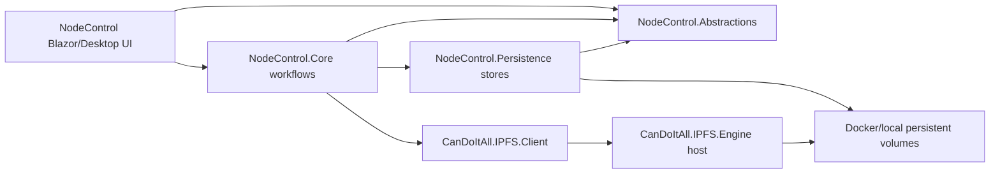

# Target Solution

## Target End State

- The repository is ready for open-source publication with updated metadata, dependency posture, onboarding docs, release validation proof, docker runtime support, and a maintainable architecture that separates UI from reusable node workflows.
- The app remains a large-screen desktop-first Blazor experience.
- Node workflows can later be hosted by a CLI without taking a dependency on Blazor components or desktop host concerns.
- Docker compose can start the node/API and persistence surfaces together with durable volumes for node data, database/index data, settings, requests, and logs.

## Proposed Layering

## Implemented SB03 Boundary

- `CanDoItAll.IPFS.NodeControl.Abstractions` now contains UI-neutral NodeControl models, persistence contracts, node connection contracts, `IpfsClientLease`, and the `INodeOperator` facade contract.
- `CanDoItAll.IPFS.NodeControl` depends inward on the abstractions project and keeps the Blazor pages, desktop host composition, concrete stores, and `NodeOperatorService`.
- `NodeOperatorService` implements `INodeOperator` and is registered in DI as both its concrete type and the UI-independent contract.
- The browser-only upload entry point remains on `NodeOperatorService` and intentionally does not enter `INodeOperator`, so the extracted contract does not require Blazor file APIs.
- SB05 should split the concrete file/content/network/repository workflows behind `INodeOperator` rather than redrawing the project boundary.

## Implemented SB05 Workflow Split

- `INodeFileWorkflow`, `INodeExplorerWorkflow`, `INodeContentWorkflow`, `INodeNetworkWorkflow`, and `INodeMaintenanceWorkflow` now live in `CanDoItAll.IPFS.NodeControl.Abstractions`.
- `CanDoItAll.IPFS.NodeControl` provides concrete workflow services for file/pin operations, explorer/index/preview operations, content APIs, network APIs, and config/repository maintenance.
- `NodeOperatorService` is now a compatibility facade over the smaller workflows so existing pages keep working while SB06 migrates UI dependencies area by area.
- Browser-file upload stays on the concrete file workflow/facade because `IBrowserFile` is a UI concern and must not enter the reusable abstraction project.
- The former 1113-line mixed service is now a 134-line facade; the longest remaining extracted workflow is the explorer/index service, which owns the virtual-folder and pinned-root indexing complexity explicitly.

## Implemented SB06 UI Split

- `Content`, `Network`, `Settings`, and `RemotePinShareModal` now have `.razor` markup files paired with `.razor.cs` code-behind files, reducing mixed markup/handler responsibilities without changing the large-screen desktop workflows.
- `Content`, `Network`, `Settings`, `Home`, and `Files` now depend on narrower workflow interfaces where possible instead of the broad `INodeOperator` facade.
- `Network` still directly uses `IpfsClientFactory` for the live PubSub subscription path, which is UI lifecycle-sensitive and remains outside the reusable workflow abstraction for now.
- `Files.razor` already uses a set of child components and was migrated to file/explorer/maintenance workflow dependencies, but `Files.razor.cs` remains a large route-state file. Further extraction into state helpers is tracked as a future candidate rather than forced into this pass.
- SB06 proof covers `/files`, `/content`, `/network`, `/settings`, and `RemotePinShareModal` at `1920x1080` and `1600x900` with no small or medium screen tuning.

## Project Boundary Candidates

| Candidate | Responsibility | Must not own |
| --- | --- | --- |
| `CanDoItAll.IPFS.NodeControl.Abstractions` | Workflow interfaces, settings contracts, request/response DTOs, persistence interfaces, UI-neutral validation result types | Blazor components, CSS, desktop host, concrete SQLite/file implementations |
| `CanDoItAll.IPFS.NodeControl.Core` | Upload/download/pin/content/network/repo workflows, explorer orchestration, preview mapping, service-level validation | Razor markup, browser file APIs, docker-specific startup, raw UI state |
| `CanDoItAll.IPFS.NodeControl.Persistence` | SQLite explorer index, JSON stores, log store, path options, migration/version checks | Page view models, command handlers, API client implementation details |
| Current `CanDoItAll.IPFS.NodeControl` | Blazor pages/components, desktop host composition, dependency injection wiring, large-screen visual behavior | Business workflow ownership that future CLI needs |

## UI Decomposition Direction

- Split large pages into route shells, state/view models, repeated component panels, command toolbars, dialogs/modals, and reusable status/error surfaces.
- Preserve desktop density; do not add mobile-first layout work.
- Use Playwright large-screen screenshots and console checks as behavioral proof for route shells and key modals.

## Performance And Storage Direction

- Treat static scan hits as investigation queues.
- Prioritize async correctness, cancellation propagation, memory allocations in repeated workflows, HTTP client lifetime, stream handling, and hot Engine/Client paths.
- Because EF Core is absent, apply the EF Core skill's intent to actual persistence: query shapes, indexes, bounded reads, parameter typing, transaction scope, and no accidental full-file/full-table loops on interactive paths.

## Implemented SB07 Performance Hardening

- DoH requests now use a shared fallback `HttpClient`, caller injection remains supported, linked cancellation tokens are disposed, responses are disposed, response streams honor cancellation, and `ResponseHeadersRead` avoids buffering the full DNS response before parsing.
- NodeControl known-node API resolution now uses the existing `IHttpClientFactory`/named-client policy instead of constructing a per-call client.
- NodeControl network snapshot aggregation awaits completed tasks after `Task.WhenAll` instead of reading `Task.Result`.
- Health-check JSON responses now reuse cached `JsonSerializerOptions`.
- Broad LINQ, collection, substring, sealing, test wait, and inherited DNS/MDNS sync findings remain documented scan leads rather than mechanical rewrites.

## Implemented SB08 Storage Hardening

- EF Core remains absent; query hardening was applied to raw SQLite and file-backed stores.
- `ExplorerIndexStore` now creates an additional pinned-root list index matching the `ListPinnedRoots` filter/sort shape.
- `ExplorerIndexStore` no longer uses `AddWithValue`; SQLite parameters are typed as text or integer explicitly.
- Pinned target update methods normalize, trim, and deduplicate target collections in one pass before building `IN` and `NOT IN` queries.
- `ApplicationLogStore` no longer counts the full active log file before every write; it initializes active count once per store lifetime or after rotation and maintains it in memory.
- JSON settings/request stores already used schema documents, atomic writes, backups, and quarantine behavior; SB08 preserved these persisted formats and kept docker path semantics unchanged.

## Docker Runtime Direction

- SB04 added root docker compose for two services: `ipfs-node` runs the Engine HTTP API and `node-control` runs the Blazor control UI against `http://ipfs-node:5001/`.
- The compose stack uses named volumes for the IPFS repo at `/data/ipfs` and NodeControl state at `/data/node-control`.
- NodeControl container configuration binds durable paths for settings JSON, remote pin request JSON, application logs, and the Explorer SQLite index.
- Persistence proof writes real node data and app data, restarts containers, rebuilds images, recreates containers, and verifies the same pinned CID, peer identity, and remote pin request remain available.
- `IPFS_PASS` is required from the caller environment and is not stored in compose files.
