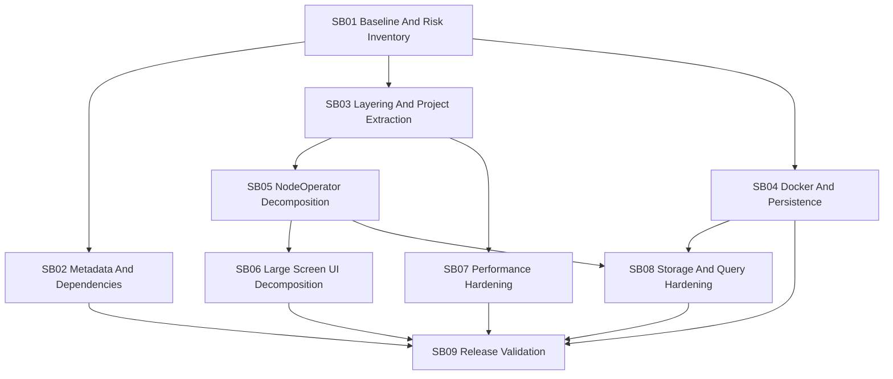

# Phase Plan

## Execution Order

| Order | Subbundle | Purpose | Gate |
| ---: | --- | --- | --- |
| 1 | SB01 Publishing Baseline And Risk Inventory | Refresh evidence and guard against stale assumptions | Baseline build/warning/checklist proof captured |
| 2 | SB02 Open Source Metadata And Dependency Hardening | Fix package metadata, docs, licensing posture, dependency advisories | Metadata/dependency proof captured |
| 3 | SB03 NodeControl Layering And Project Extraction | Create UI-independent workflow boundaries | Build/test proof and dependency graph clean |
| 4 | SB04 Persistence And Docker Compose Runtime | Add compose/runtime persistence with durable volumes | Data survives restart and rebuild |
| 5 | SB05 NodeOperator Service Decomposition | Split workflow responsibilities out of the large service | Behavior-preserving tests pass |
| 6 | SB06 Large Screen UI Component Decomposition | Split large pages/modals without mobile scope creep | Playwright large desktop proof captured |
| 7 | SB07 Engine Client Performance Hardening | Triage and fix high-value .NET performance issues | Focused tests/perf evidence captured |
| 8 | SB08 Data Access Query And Storage Hardening | Harden raw SQLite/JSON/log stores | Storage tests and persistence proof captured |
| 9 | SB09 Release Validation Documentation And Handoff | Final build/test/docker/browser/docs/package validation | Final closure report complete |

## Subbundle Dependency Map

## Critical Subbundles

- SB03 is architecture-critical because it determines whether a future CLI can reuse node workflows without UI dependencies.
- SB04 is release-critical because docker data loss would make the published app unsafe to operate.
- SB08 is data-critical because EF Core is absent and the actual durability/query behavior lives in raw SQLite/JSON/log stores.
- SB09 is closure-critical because it proves the open-source publishing preparation actually resulted in releasable behavior and documentation.

## Phase Gates

- Gate after preparation: run the bundle validator and repair failures.
- Gate before each subbundle: confirm prerequisites are complete and still valid.
- Gate after each subbundle: capture proof, review screenshots, and decide whether downstream work may continue.
- Gate before closure: rerun validators, close raw notes, and reopen anything with weak proof.

## Proof Expectations

- Every subbundle must update `bundle://reviews/01-execution-report.md`.
- Critical subbundles must create proof manifests under `bundle://proof/SBxx` during implementation.
- Browser evidence is required for SB06 and SB09 at `1920x1080` and `1600x900`.
- Docker evidence is required for SB04 and must include actual persisted data after restart and rebuild.
